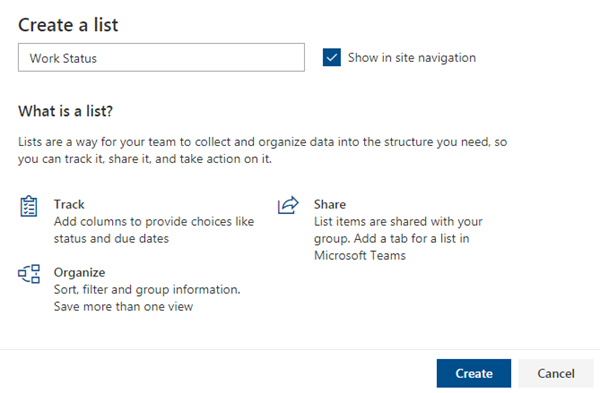
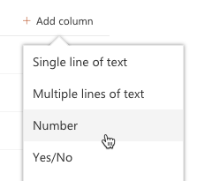
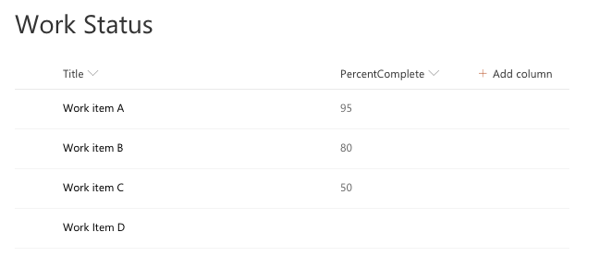
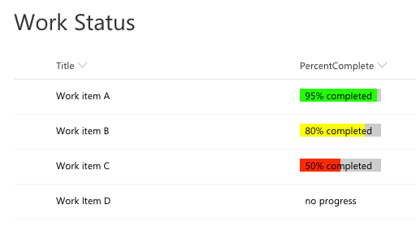

# DEMO: Field Customizers

In this demo you will test a SharePoint Framework (SPFx) field customizer extension that will display a colored bar in a column with a percentage of the bar filled depending on the value in the field.

1. In a browser, navigate to a SharePoint Online modern site collection where you want to test the field customizer.
1. Select the **Site contents** link in the left-hand navigation.
1. Create a new SharePoint list:
    1. Select **New > List** in the toolbar.
    1. Set the list name to **Work Status** and select **Create**.

        

    1. When the list loads, select the **Add column > Number** to create a new column.

        

    1. When prompted for the name of the column, enter **PercentComplete**.
    1. Add a few items to the list, such as the following:

        

1. Open a command prompt and navigate to the folder that contains the built project for this demo.
1. Download and install all necessary dependencies using the following command:

    ```shell
    npm install
    ```

1. Update the properties for the serve configuration used to test and debug the extension:
    1. Locate and open the **./config/serve.json** file.
    1. Copy in the full URL (including **AllItems.aspx**) of the list you just created into the `serveConfigurations.default.pageUrl` property.

        The JSON for the default serve configuration should look something like the following:

        ```json
        "default": {
            "pageUrl": "https://contoso.sharepoint.com/sites/mySite/Lists/Work%20Status/AllItems.aspx",
            "fieldCustomizers": {
                "PercentComplete": {
                    "id": "6a1b8997-00d5-4bc7-a472-41d6ac27cd83",
                    "properties": {
                        "greenMinLimit": "85",
                        "yellowMinLimit": "70"
                    }
                }
            }
        }
        ```        

1. Run the project by executing the following command:

    ```shell
    gulp serve
    ```

1. When prompted, select the **Load debug scripts** button.
1. Notice when the page loads, notice how the rendering has changed according to the code in your field customizer:

    

1. Stop the local web server by pressing <kbd>CTRL</kbd>+<kbd>C</kbd> in the console/terminal window.
