# Deploy SPFx Solutions to Microsoft Teams

In this demo you will create a SharePoint Framework (SPFx) solution that will work in both SharePoint and as a tab in Microsoft Teams.

> NOTE: The instructions below assume you are using v1.9.1 of the SharePoint Framework Yeoman generator.

1. Open a command prompt and change to the folder where you want to create the project.
1. Run the SharePoint Yeoman generator by executing the following command:

    ```shell
    yo @microsoft/sharepoint
    ```

    Use the following to complete the prompt that is displayed:

    - **What is your solution name?**: spfxteams
    - **Which baseline packages do you want to target for your component(s)?**: SharePoint Online only (latest)
    - **Where do you want to place the files?**: Use the current folder
    - **Do you want to allow the tenant admin the choice of being able to deploy the solution to all sites immediately without running any feature deployment or adding apps in sites?**: Yes
    - **Will the components in the solution require permissions to access web APIs that are unique and not shared with other components in the tenant?**: No
    - **Which type of client-side component to create?**: Web Part
    - **What is your Web Part name?**: SPFx Teams Together
    - **What is your Web Part description?**: SPFx Teams Together description
    - **Which framework would you like to use?** No JavaScript framework

    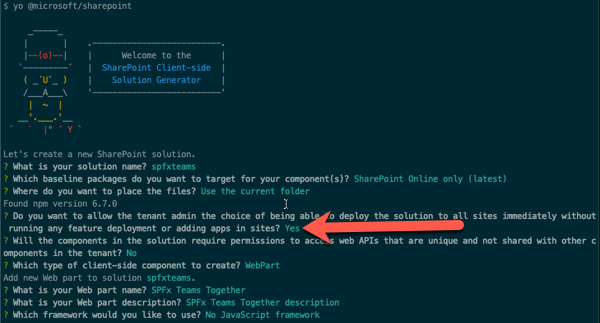

    After provisioning the folders required for the project, the generator will install all the dependency packages using NPM.

1. Open the project in an editor such as Visual Studio Code (*aka: VSCode*).

    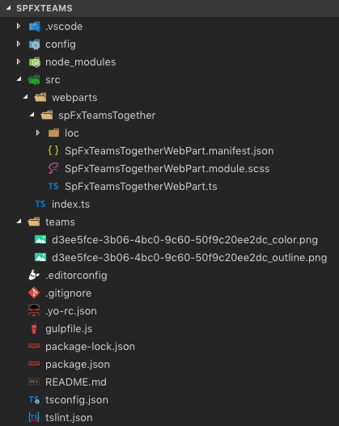

1. Enable the web part to be used in Microsoft Teams:
    1. Locate and open the file **./src/webparts/spFxTeamsTogether/SpFxTeamsTogetherWebPart.manifest.json**:
    1. Within the web part manifest file, locate the property `supportedHosts`:

        ```ts
        "supportedHosts": ["SharePointWebPart"],
        ```

        Add another option to enable this web part to be used as a tab in a Microsoft Teams team:

        ```ts
        "supportedHosts": ["SharePointWebPart", "TeamsTab"],
        ```

### Create and Deploy the Microsoft Teams App Package

1. Notice the project contains a folder **teams** that contains two images. These are used in Microsoft Teams to display the custom tab.

    > You may notice there is no **manifest.json** file present. The manifest file can be generated automatically by SharePoint from the **App Catalog** site. However, at this time, this functionality is not fully operational.
    >
    > Alternatively, you can manually create the manifest file if you want to have more control over the default values SharePoint will create. For more information on this, refer to the documentation: [Create Microsoft Teams manifest manually for a web part and deploy it to Microsoft Teams](https://docs.microsoft.com/sharepoint/dev/spfx/web-parts/guidance/creating-team-manifest-manually-for-webpart).
    >
    > Because the automatic generation & deployment of the Microsoft Teams manifest is not currently operational, you will manually create the Microsoft Teams manifest and package.

1. Manually create the Microsoft Teams manifest and app package:
    1. Copy the **manifest.json** file from [Resources/manifest.json](../../Resources/manifest.json) to the **./teams** folder in your project.
    1. Open the **manifest.json** file. This file contains multiple strings that need to be updated to match the SPFx component. Use the following table to determine the values that should be replaced. The SPFx component properties are found in the web part manifest file: **./src/webparts/spFxTeamsTogether/SpFxTeamsTogetherWebPart.manifest.json**

        |          manifest.json string          |  Property in SPFx component manifest  |
        | -------------------------------------- | ------------------------------------- |
        | `{{SPFX_COMPONENT_ALIAS}}`             | `alias`                               |
        | `{{SPFX_COMPONENT_NAME}}`              | `preconfiguredEntries[0].title`       |
        | `{{SPFX_COMPONENT_SHORT_DESCRIPTION}}` | `preconfiguredEntries[0].description` |
        | `{{SPFX_COMPONENT_LONG_DESCRIPTION}}`  | `preconfiguredEntries[0].description` |
        | `{{SPFX_COMPONENT_ID}}`                | `id`                                  |

    > Note: Don't miss replacing `{{SPFX_COMPONENT_ID}}` in `configurableTabs[0].configurationUrl`. You will likely have to scroll your editor to the right to see it.

    > Note: The tokens surrounded by single curly braces (e.g. `{teamSiteDomain}`) do not need to be replaced.

    1. Create a Microsoft Teams app package by zipping the contents of the **./teams** folder. Make sure to zip just the contents and not the folder itself. This ZIP archive should contain 3 files at the root: two images & the **manifest.json**.

### Create and Deploy the SharePoint Package

1. In order to test the web part in SharePoint and Microsoft Teams, it must first be deployed to an app catalog.
    1. Open a browser and navigate to your SharePoint Online Tenant-Scoped App Catalog site.
    1. Select the menu item **Apps for SharePoint** from the left-hand navigation menu.
    1. Build the project by opening a command prompt and changing to the root folder of the project. Then execute the following command:

        ```shell
        gulp build
        ```

    1. Next, create a production bundle of the project by running the following command on the command line from the root of the project:

        ```shell
        gulp bundle --ship
        ```

    1. Finally, create a deployment package of the project by running the following command on the command line from the root of the project:

        ```shell
        gulp package-solution --ship
        ```

    1. Locate the file created by the gulp task, found in the **./sharepoint/solution** folder with the name ***.sppkg**.
    1. Drag this file into the **Apps for SharePoint** library in the browser:

        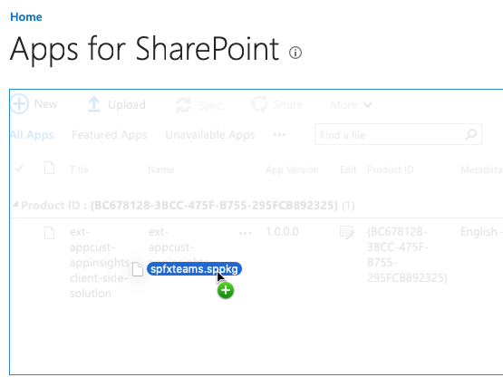

    1. In the **Do you trust...?** dialog, select the checkbox **Make this solution available to all sites in the organization** and then select **Deploy**.

        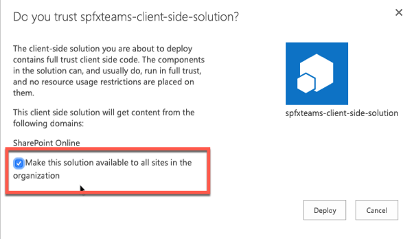

        This will make this SPFx web part available to all site collections in the tenant, including those that are behind a Microsoft Teams team.

### Test the Web Part in SharePoint & Microsoft Teams

1. Test the SPFx web part in SharePoint:
    1. In the browser, navigate to a modern SharePoint page.
    1. Select the **Edit** button in the top-right of the page.
    1. Select the (+) icon to open the SharePoint web part toolbox and locate the web part **SPFx Teams Together**:

        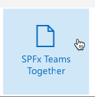

    1. The SharePoint Framework web part will be displayed on the page as shown in the following figure:

        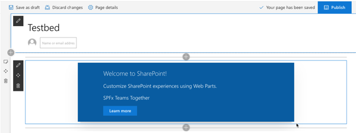

1. Test the SPFx web part in Microsoft Teams:
    1. First, create a new Microsoft Teams team.

        Using the same browser where you are logged into SharePoint Online, navigate to https://teams.microsoft.com. When prompted, load the web client.

        1. If you do not have any teams in your tenant, you will be presented with the following dialog. Otherwise, select the **Join or create a team** at the bottom of the list of teams:

            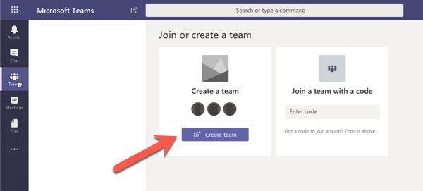

        1. On the **Create your team** dialog, select **Build a team from scratch**:

            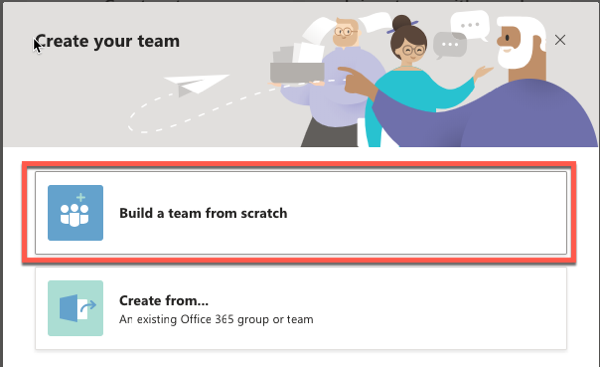

        1. On the **What kind of team will this be?** dialog, select **Public**:

            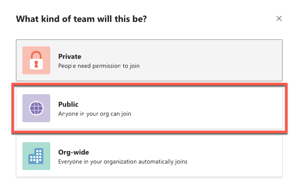

        1. When prompted, use the name **My First Team**.

    1. Install the Microsoft Teams application as a new tab that will expose the SharePoint Framework web part in Microsoft Teams:
        1. Select the **My First Team** team previously created.
        1. Select the **General** channel.

            

        1. Add a custom tab to the team using the SPFx web part:
            1. At the top of the page, select the + icon in the horizontal navigation:

                

            1. In the **Add a tab** dialog, select **More Apps**

                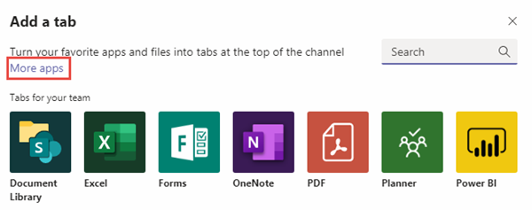

            1. Select the **Upload a custom app** > **Upload for ...** from the list of app categories:

                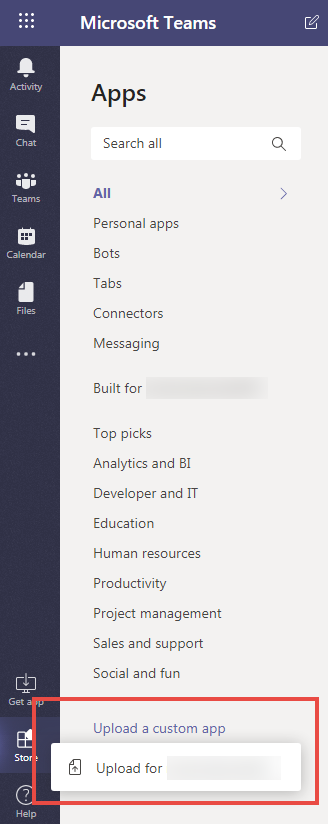

            1. Select the Microsoft Teams application ZIP file previously created. This is the file that contains the **manifest.json** and two image files.

                After a moment, the application will appear next to your tenant name.

                > You may need to refresh the page for the app to appear if you are using the browser Microsoft Teams client.

            1. Select the **SPFx Teams Together** app.

                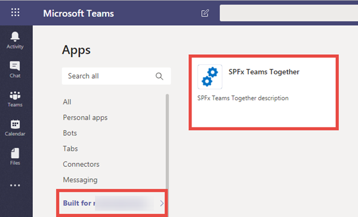

            1. In the **SPFx Teams Together** dialog, select the **My First Team** in the **Add to a team** dropdown control and select **Install**.

                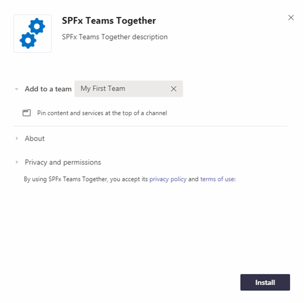

            1. In the **SPFx Teams Together is now available for My First Team** dialog, select the **General** channel and select **Set up**.

                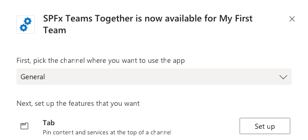

            1. The next dialog will confirm the installation of the app. Select **Save**.

                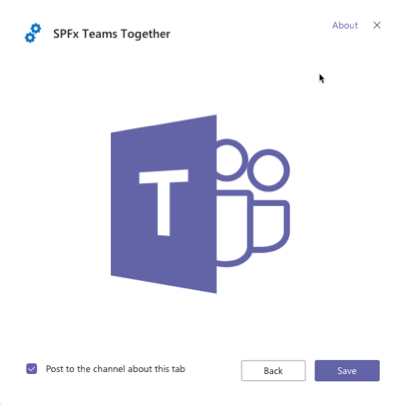

            1. The application should now load in Microsoft Teams within the **General** channel under the tab **SPFx Teams Together**.

                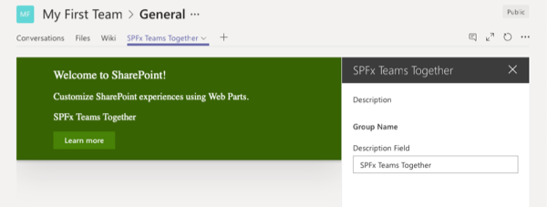

            1. Select the **X** in the upper-right corner of the property pane to close the initial configuration.